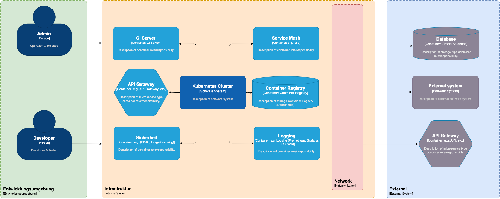
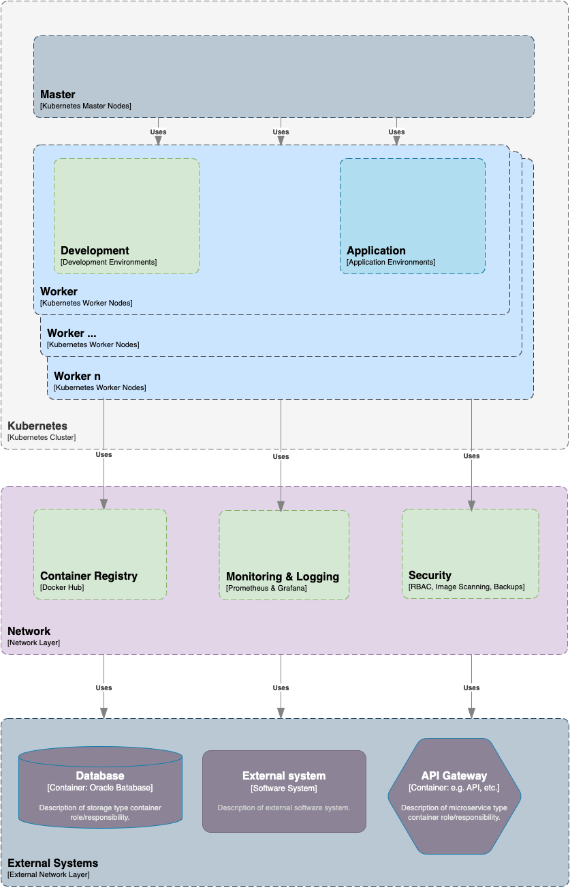
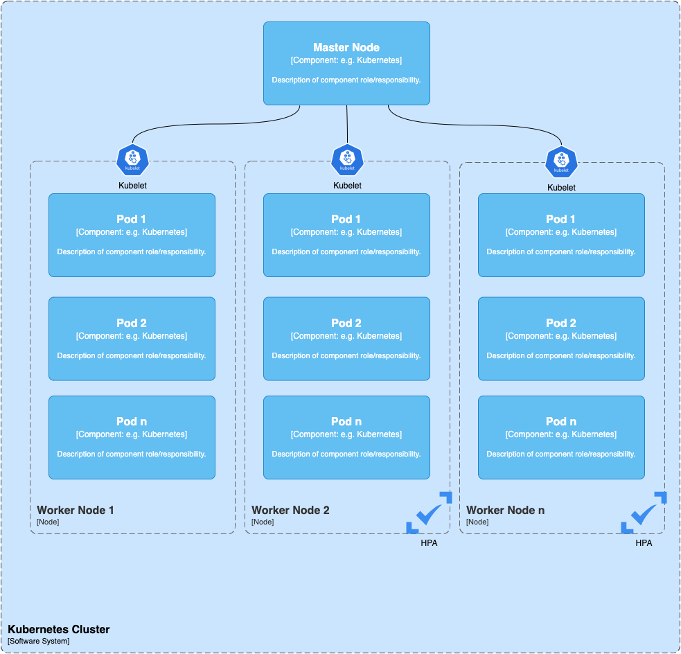
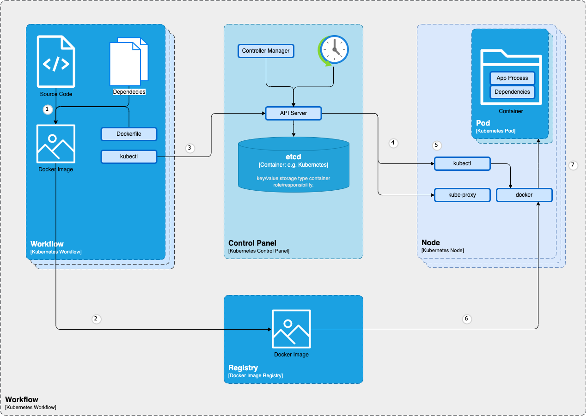

# 1. Einleitung und Ziele

## 1.1 Einleitung
Dieses Dokument beschreibt die Systemarchitektur für eine universelle Plattform in einem mittelständischen Unternehmen unter Verwendung des arc42 Templates. Die Plattform soll eine skalierbare und flexible Umgebung für die Entwicklung und den Betrieb von Anwendungen bieten.

## 1.2 Zielsetzung
- Bereitstellung einer skalierbaren Entwicklungs- und Betriebsplattform für bis zu 100 Entwickler.
- Nutzung von Open Source Technologien und Lösungen.
- Implementierung grundlegender Sicherheitsmaßnahmen.
- Integration bestehender Umsysteme des Unternehmens.

# 2. Randbedingungen

## 2.1 Technische Randbedingungen
- **Technologie**: Kubernetes
- **Plattformart**: Universelle Plattform für Entwicklung und Betrieb
- **Software**: Open Source Lösungen

## 2.2 Organisatorische Randbedingungen
- **Unternehmensgröße**: Mittelständisches Unternehmen
- **Nutzer**: 100 Entwickler

## 2.3 Rahmenbedingungen
- **Sicherheitsanforderungen**: Basic Security
- **Integration**: Umsysteme

# 3. Kontextabgrenzung

## 3.1 Systemkontext
- **Intern**: Kubernetes Cluster, CI/CD Tools (GitHub Action), Container Registry (Docker Hub), Monitoring und Logging (Prometheus, Grafana, EFK Stack), Sicherheitslösungen (RBAC, Image Scanning), API Gateway, Service Mesh (Istio).
- **Extern**: Umsysteme des Unternehmens, externe Entwickler-Tools und -Dienste.

## 3.2 Benutzerschnittstellen
- Entwicklerzugang zu Entwicklungsumgebungen, CI/CD Pipelines, Monitoring Dashboards, Container Registry und API Gateway.

---

# 4. Lösungsstrategie

## 4.1 Hauptziele
- Einrichtung eines Kubernetes Clusters zur Bereitstellung der Plattform.
- Bereitstellung von Entwicklungsumgebungen mit Open Source Tools.
- Implementierung grundlegender Sicherheitsmaßnahmen.
- Integration externer Systeme und Dienste.

## 4.2 Entwurfsprinzipien
- **Skalierbarkeit**: Berücksichtigung der Skalierbarkeit für bis zu 100 Entwickler.
- **Sicherheit**: Implementierung von Basis-Sicherheitsmaßnahmen.
- **Integration**: Planung der Anbindung externer Systeme.

# 4. Lösungsstrategie

## 4.1 Hauptziele
- Einrichtung eines Kubernetes Clusters zur Bereitstellung der Plattform.
- Bereitstellung von Entwicklungsumgebungen mit Open Source Tools.
- Implementierung grundlegender Sicherheitsmaßnahmen.
- Integration externer Systeme und Dienste.

## 4.2 Entwurfsprinzipien
- **Skalierbarkeit**: Berücksichtigung der Skalierbarkeit für bis zu 100 Entwickler.
- **Sicherheit**: Implementierung von Basis-Sicherheitsmaßnahmen.
- **Integration**: Planung der Anbindung externer Systeme.

# 5. Bausteinsicht

## 5.1 Bausteindiagramm

## 5.2 Bausteinbeschreibung

### **Kubernetes Cluster**

- **Master Node**: Verwaltung und Steuerung des Clusters.
- **Worker Nodes**: Ausführung der Container.

  
### **Entwicklerumgebung**

- **CI/CD Tools**: Jenkins für die kontinuierliche Integration und Bereitstellung.
- **Version Control**: Git für die Versionsverwaltung.

### **Container Registry**

- **Docker Hub**: Verwaltung und Speicherung von Container Images.

### **Monitoring und Logging**

- **Prometheus**: Überwachung und Alarmierung.
- **Grafana**: Visualisierung der Metriken.
- **Elasticsearch, Fluentd, Kibana (EFK Stack)**: Zentrale Speicherung und Analyse von Logs.

### **Security**

- **RBAC**: Verwaltung von Benutzerrechten.
- **Image Scanning**: Sicherheitsüberprüfung von Container Images (z.B. Clair).

### **Integration von Umsystemen**

- **API Gateway**: Verwaltung der Schnittstellen zu externen Systemen.
- **Service Mesh**: Verwaltung der Kommunikation zwischen Microservices (z.B. Istio).
- **Datenbank Mesh**: Relationales Datenbank (z.B. Oracle).

# 6. Laufzeitsicht

## 6.1 Hauptszenarien
- **Deployment von Anwendungen**: Ablauf von der Code-Übernahme aus dem Repository, über die CI/CD Pipeline, bis zur Bereitstellung im Kubernetes Cluster.
- **Monitoring und Logging**: Erfassung und Analyse von Metriken und Logs zur Überwachung des Systemzustands.
- **Sicherheitsüberprüfung**: Scannen und Überprüfen von Container Images vor der Bereitstellung.

# 7. Verteilungssicht

## 7.1 Infrastruktur
- **Kubernetes Cluster**: Verteilung der Master und Worker Nodes auf physische oder virtuelle Maschinen.
- **Container Registry**: Bereitstellung und Zugriff auf Container Images.
- **Monitoring und Logging Infrastruktur**: Verteilung von Prometheus, Grafana und dem EFK Stack.

# 8. Querschnittliche Konzepte

## 8.1 Sicherheit
- **RBAC**: Implementierung von Role-Based Access Control zur Verwaltung von Benutzerrechten.
- **Image Scanning**: Einsatz von Tools wie Clair zur Sicherheitsüberprüfung von Container Images.

## 8.2 DevOps
- **CI/CD Pipeline**: Verwendung von GitHub CI Server für kontinuierliche Integration und Bereitstellung.
- **Versionsverwaltung**: Nutzung von Git für die Versionskontrolle.

# 9. Entwurfsentscheidungen

## **Kubernetes**
Gewählt aufgrund seiner Skalierbarkeit und Flexibilität.

## **Open Source Tools** 
Verwendung von Jenkins, Prometheus, Grafana, EFK Stack, um Kosten zu sparen und auf bewährte Lösungen zurückzugreifen.

## **RBAC und Image Scanning**
Sicherstellung grundlegender Sicherheitsmaßnahmen.

## Netzwerk- und Kommunikationssicherheit

### Netzwerkisolation
- **Beschreibung:** Nutzung von Kubernetes Network Policies zur Steuerung der Kommunikation zwischen Pods und zur Begrenzung des Datenverkehrs auf notwendige Verbindungen.
- **Begründung:** Erhöhung der Sicherheit durch Minimierung potenzieller Angriffsflächen.

### Verschlüsselung
- **Beschreibung:** Einsatz von TLS/SSL zur Verschlüsselung der Kommunikation innerhalb des Clusters sowie zwischen dem Cluster und externen Systemen.
- **Begründung:** Sicherstellung der Vertraulichkeit und Integrität der Daten während der Übertragung.

## Continuous Integration/Continuous Deployment (CI/CD)

### Pipeline-Integration
- **Beschreibung:** Einbindung von CI/CD-Pipelines, die Tools wie Jenkins verwenden und in den Kubernetes-Cluster integriert sind.
- **Begründung:** Automatisierung der Build-, Test- und Deployment-Prozesse zur Erhöhung der Effizienz und Reduktion manueller Fehler.

### Automatisierte Tests
- **Beschreibung:** Integration von Unit-, Integrations- und End-to-End-Tests in die CI/CD-Pipelines.
- **Begründung:** Sicherstellung der Qualität und Stabilität der Software durch frühzeitiges Erkennen von Fehlern.

### Deployment-Strategien
- **Beschreibung:** Nutzung von Blue-Green-Deployments oder Canary-Deployments zur Minimierung von Ausfallzeiten und Risiken.
- **Begründung:** Erhöhung der Systemverfügbarkeit und Reduktion von Risiken bei Deployments.

## Storage und Persistenz

### Persistente Volumes
- **Beschreibung:** Nutzung von Kubernetes Persistent Volumes (PVs) und Persistent Volume Claims (PVCs) zur Verwaltung von Daten, die von Anwendungen benötigt werden.
- **Begründung:** Sicherstellung der Datenpersistenz und Verwaltung von speicherintensiven Anwendungen.

### Backup und Wiederherstellung
- **Beschreibung:** Implementierung von Backup- und Wiederherstellungsstrategien für persistente Daten.
- **Begründung:** Schutz vor Datenverlust und Sicherstellung der Datenverfügbarkeit.

## Skalierbarkeit und Hochverfügbarkeit

### Autoscaling
- **Beschreibung:** Einsatz des Kubernetes Horizontal Pod Autoscalers (HPA) zur automatischen Skalierung der Anwendungspods basierend auf der aktuellen Last.
- **Begründung:** Optimierung der Ressourcennutzung und Sicherstellung der Anwendungsperformance.

### Hochverfügbarkeit
- **Beschreibung:** Sicherstellung der Hochverfügbarkeit der Kubernetes-Master-Komponenten und redundante Worker-Nodes zur Minimierung von Ausfallzeiten.
- **Begründung:** Erhöhung der Ausfallsicherheit und Betriebsbereitschaft des Systems.

## Benutzer- und Zugriffsverwaltung

### Single Sign-On (SSO)
- **Beschreibung:** Integration von SSO-Lösungen zur zentralen Benutzerverwaltung und Authentifizierung.
- **Begründung:** Vereinfachung der Benutzerverwaltung und Erhöhung der Sicherheit durch zentrale Authentifizierung.

### Audit Logs
- **Beschreibung:** Implementierung von Audit-Logging zur Nachverfolgung von Benutzeraktivitäten und Änderungen innerhalb des Clusters.
- **Begründung:** Erhöhung der Transparenz und Unterstützung der Fehlerbehebung und Sicherheitsüberwachung.

## Service Discovery und Load Balancing

### Interne Service Discovery
- **Beschreibung:** Nutzung von Kubernetes DNS zur automatischen Erkennung und Verbindung von Diensten innerhalb des Clusters.
- **Begründung:** Vereinfachung der Dienstverbindungen und Erhöhung der Flexibilität bei der Dienstverwaltung.

### Load Balancing
- **Beschreibung:** Einsatz von Kubernetes Ingress Controllern oder Service Mesh-Lösungen wie Istio zur Verwaltung und Verteilung des internen Traffics.
- **Begründung:** Sicherstellung der gleichmäßigen Verteilung des Datenverkehrs und Erhöhung der Systemstabilität.

## Dokumentation

### Erstellung von Dokumentation
- **Beschreibung:** Entwicklung und Pflege umfassender Dokumentation für die Architektur, die verwendeten Tools, Best Practices und Prozesse.
- **Begründung:** Sicherstellung, dass das System von den Entwicklern richtig verstanden und genutzt wird, was die Effektivität und Effizienz der Entwicklungs- und Betriebsprozesse erhöht.

### Schulung
- **Beschreibung:** Durchführung von Schulungen und Workshops für die Entwickler, um sicherzustellen, dass sie die neue Umgebung effektiv nutzen können.
- **Begründung:** Förderung des Wissens und der Fähigkeiten der Entwickler, was zu einer besseren Nutzung und Verwaltung des Systems führt.

## Compliance und Datenschutz

### Compliance-Anforderungen
- **Beschreibung:** Sicherstellung, dass die Plattform alle relevanten gesetzlichen und regulatorischen Anforderungen erfüllt (z.B. GDPR, HIPAA).
- **Begründung:** Vermeidung rechtlicher Probleme und Schutz der Rechte der Benutzer.

### Datenschutz
- **Beschreibung:** Implementierung von Datenschutzmaßnahmen zur Sicherung sensibler Daten.
- **Begründung:** Schutz der Privatsphäre und Vertraulichkeit der Benutzerdaten.

## Fehlerbehandlung und Wiederherstellung

### Fehlerbehandlung
- **Beschreibung:** Entwicklung und Implementierung von Strategien zur Erkennung und Behandlung von Fehlern.
- **Begründung:** Sicherstellung der Systemstabilität und Minimierung von Ausfallzeiten.

### Disaster Recovery
- **Beschreibung:** Planung und Implementierung von Disaster-Recovery-Strategien zur schnellen Wiederherstellung des Betriebs im Falle eines schwerwiegenden Fehlers.
- **Begründung:** Erhöhung der Resilienz und Wiederherstellungsfähigkeit des Systems.

## Kostenmanagement

### Kostenüberwachung
- **Beschreibung:** Implementierung von Tools und Prozessen zur Überwachung und Optimierung der Infrastrukturkosten.
- **Begründung:** Kontrolle der Betriebskosten und Sicherstellung der Wirtschaftlichkeit des Systems.

### Ressourcenkontrolle
- **Beschreibung:** Nutzung von Kubernetes Resource Quotas und Limits zur Kontrolle der Ressourcennutzung und zur Vermeidung unnötiger Ausgaben.
- **Begründung:** Optimierung der Ressourcennutzung und Vermeidung von Kostenüberschreitungen.

# 10. Qualitätsanforderungen

## 10.1 Qualitätsziele
- **Skalierbarkeit**: Unterstützung von bis zu 100 Entwicklern.
- **Sicherheit**: Implementierung von Basis-Sicherheitsmaßnahmen.
- **Verfügbarkeit**: Sicherstellung einer hohen Verfügbarkeit der Plattform.

## 10.2 Qualitätsmaßnahmen
- **Monitoring**: Einsatz von Prometheus und Grafana zur Überwachung der Systemgesundheit.
- **Logging**: Nutzung des EFK Stacks zur zentralen Speicherung und Analyse von Logs.
- **Sicherheitsüberprüfungen**: Regelmäßige Scans von Container Images.

# 11. Risiken und technische Schulden

## 11.1 Risiken
- **Skalierbarkeit**: Risiko, dass das System nicht ausreichend skaliert.
- **Sicherheit**: Risiko unzureichender Sicherheitsmaßnahmen.

## 11.2 Maßnahmen zur Risikominderung
- **Lasttests**: Durchführung von Lasttests zur Sicherstellung der Skalierbarkeit.
- **Sicherheitsaudits**: Regelmäßige Sicherheitsaudits zur Identifikation und Behebung von Schwachstellen.

# Glossary

| Term                    | Beschreibung                                                                                                         | 
|-------------------------|----------------------------------------------------------------------------------------------------------------------| 
| Kubernetes              | Container-Orchestrierungsplattform                                                                                   |
| CI/CD                   | Continuous Integration und Continuous Deployment                                                                     |
| IaC                     | Infrastructure as Code, managing and provisioning computing infrastructure through machine-readable definition files |
| RBAC                    | Role-Based Access Control                                                                                            |
| EFK Stack               | Elasticsearch, Fluentd, Kibana für Logging                                                                           |

