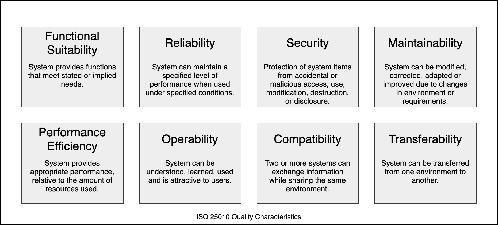

# 1. Einleitung und Ziele

## 1.1 Einleitung
Dieses Dokument beschreibt die Systemarchitektur für eine universelle Plattform in einem mittelständischen Unternehmen unter Verwendung des arc42 Templates. Die Plattform soll eine skalierbare und flexible Umgebung für die Entwicklung und den Betrieb von Anwendungen bieten.

## 1.2 Zielsetzung
- Bereitstellung einer skalierbaren Entwicklungs- und Betriebsplattform für bis zu 100 Entwickler.
- Nutzung von Open Source Technologien und Lösungen.
- Implementierung grundlegender Sicherheitsmaßnahmen.
- Integration bestehender Umsysteme des Unternehmens.

## 1.3 Qualitätsziele

Die drei (maximal fünf) wichtigsten Qualitätsziele für die Architektur, deren Erfüllung für die Hauptinteressenten von höchster Bedeutung ist. 
Wir meinen wirklich Qualitätsziele für die Architektur. Verwechseln Sie diese nicht mit Projektzielen. Sie sind nicht unbedingt identisch.

Der ISO 25010 Standard bietet einen guten Überblick über mögliche Interessensgebiete:

### 1. Skalierbarkeit

Die Architektur muss in der Lage sein, sich dynamisch an die wachsende Anzahl von Benutzern, Anwendungen und Daten anzupassen, ohne die Leistung zu beeinträchtigen.

### 2. Zuverlässigkeit und Verfügbarkeit

Die Architektur muss eine hohe Zuverlässigkeit und Verfügbarkeit bieten, um sicherzustellen, 
dass die Anwendungen und Dienste jederzeit verfügbar sind und Ausfälle minimiert werden.

### 3. Sicherheit

Die Architektur muss Sicherheitsmechanismen implementieren, um die Integrität, Vertraulichkeit und Verfügbarkeit der Daten und Anwendungen zu gewährleisten.

### 4. Wartbarkeit und Erweiterbarkeit

Die Architektur muss so gestaltet sein, dass sie leicht gewartet und erweitert werden kann, um zukünftige Anforderungen und Änderungen zu unterstützen.

### 5. Leistungseffizienz

Die Architektur muss effizient arbeiten, um optimale Leistung zu bieten und Ressourcenverschwendung zu vermeiden.

## 1.4 Stakeholder

| Name         | Rolle                | Kontakt                 | Erwartungen                            |
|--------------|----------------------|-------------------------|----------------------------------------|
| Mario Tema   | Enterprise Architect | microtema@web.de        | Architektur-Design und -Bewertung      |
| Julius Cesar | Solution Architect   | julius@cesar.de         | Lösungsdesign und Implementierung      |
| Marco Polo   | Projekt Manager      | marcpo@polo.de          | ...                                    |
| name         | role                 | contact                 | excpecation                            |