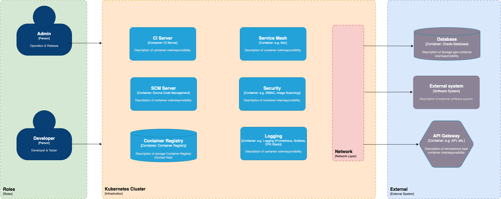

# 1. Einleitung und Ziele

## 1.1 Einleitung
Dieses Dokument beschreibt die Systemarchitektur für eine universelle Plattform in einem mittelständischen Unternehmen unter Verwendung des arc42 Templates. Die Plattform soll eine skalierbare und flexible Umgebung für die Entwicklung und den Betrieb von Anwendungen bieten.

## 1.2 Zielsetzung
- Bereitstellung einer skalierbaren Entwicklungs- und Betriebsplattform für bis zu 100 Entwickler.
- Nutzung von Open Source Technologien und Lösungen.
- Implementierung grundlegender Sicherheitsmaßnahmen.
- Integration bestehender Umsysteme des Unternehmens.

