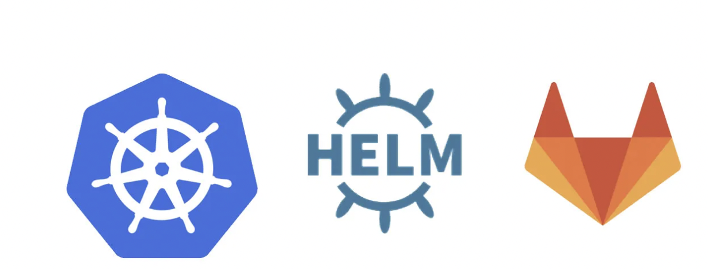

# 4. Lösungsstrategie

## 4.1 Hauptziele

### Einrichtung eines Kubernetes Clusters zur Bereitstellung der Plattform.

Um einen Kubernetes-Cluster zur Bereitstellung einer Plattform einzurichten, können Sie [Kubeadm](https://kubernetes.io/docs/setup/production-environment/tools/kubeadm/install-kubeadm/) verwenden, 
da es eine bewährte Methode zur Einrichtung von produktionsreifen Kubernetes-Clustern ist. 
Hier ist eine detaillierte Schritt-für-Schritt-Anleitung:


#### Voraussetzungen

* Mindestens zwei Server (einen für den Master-Node und einen oder mehrere für die Worker-Nodes) mit einer unterstützten Linux-Distribution (Ubuntu 20.04 LTS wird empfohlen).
* Jeder Server sollte mindestens 2 CPUs und 2 GB RAM haben.
* Root-Zugriff auf die Server.
* Internetzugang für die Server, um Pakete herunterzuladen und Container-Images zu ziehen.

##### Schritt 1: Vorbereitungen auf allen Servern

**Swap deaktivieren**

Deaktivieren Sie Swap auf allen Servern, da Kubernetes dies nicht unterstützt.

```
sudo swapoff -a
```

Um dies dauerhaft zu machen, entfernen Sie die Swap-Einträge in der Datei /etc/fstab.

**Docker installieren**

Installieren Sie Docker auf allen Servern.

```
sudo apt-get update
sudo apt-get install -y apt-transport-https ca-certificates curl software-properties-common
curl -fsSL https://download.docker.com/linux/ubuntu/gpg | sudo apt-key add -
sudo add-apt-repository "deb [arch=amd64] https://download.docker.com/linux/ubuntu $(lsb_release -cs) stable"
sudo apt-get update
sudo apt-get install -y docker-ce
```

**Kubernetes-Pakete installieren**

Installieren Sie kubeadm, kubelet und kubectl auf allen Servern.

```
sudo apt-get update && sudo apt-get install -y apt-transport-https curl
curl -s https://packages.cloud.google.com/apt/doc/apt-key.gpg | sudo apt-key add -
sudo bash -c 'cat <<EOF >/etc/apt/sources.list.d/kubernetes.list
deb https://apt.kubernetes.io/ kubernetes-xenial main
EOF'
sudo apt-get update
sudo apt-get install -y kubelet kubeadm kubectl
sudo apt-mark hold kubelet kubeadm kubectl
```

##### Schritt 2: Master-Node initialisieren

Initialisieren Sie den Master-Node. Dies wird den Kubernetes-Cluster erstellen und konfigurieren.

```
sudo kubeadm init --pod-network-cidr=192.168.0.0/16
```

[What is CIDR?](https://aws.amazon.com/what-is/cidr/#:~:text=Classless%20Inter%2DDomain%20Routing%20(CIDR)%20allows%20network%20routers%20to,specified%20by%20the%20CIDR%20suffix.)

Nach der Initialisierung sehen Sie einen Ausgabeblock, der die Schritte beschreibt, die zur Fertigstellung der Konfiguration erforderlich sind. 
Notieren Sie sich den kubeadm join-Befehl, der zum Hinzufügen von Worker-Nodes verwendet wird.

**Kubectl konfigurieren**

Konfigurieren Sie kubectl für den aktuellen Benutzer.

```
mkdir -p $HOME/.kube
sudo cp -i /etc/kubernetes/admin.conf $HOME/.kube/config
sudo chown $(id -u):$(id -g) $HOME/.kube/config
```

##### Schritt 3: Netzwerk-Plugin installieren

Installieren Sie ein Netzwerk-Plugin, um die Pod-Kommunikation zu ermöglichen. In diesem Beispiel verwenden wir Calico.

```
kubectl apply -f https://docs.projectcalico.org/manifests/calico.yaml
```

##### Schritt 4: Worker-Nodes hinzufügen

Führen Sie den von kubeadm init generierten kubeadm join-Befehl auf jedem Worker-Node aus, um sie dem Cluster hinzuzufügen. Beispiel:

```
sudo kubeadm join <master-ip>:<master-port> --token <token> --discovery-token-ca-cert-hash sha256:<hash>
```

##### Schritt 5: Überprüfen des Clusters

Überprüfen Sie, ob alle Nodes dem Cluster beigetreten sind und ordnungsgemäß funktionieren.

````
kubectl get nodes
````

##### Schritt 6: Bereitstellung der Plattform

Nachdem der Cluster eingerichtet ist, können Sie mit der Bereitstellung Ihrer Plattform beginnen. 

Dies beinhaltet das Erstellen und Anwenden von Kubernetes-Manifestdateien 

* Deployments
* Services
* ConfigMaps
* etc.

**Beispiel: Bereitstellung einer einfachen Anwendung**

1. Deployment erstellen:
   Erstellen Sie eine Datei namens deployment.yaml:

```
apiVersion: apps/v1
kind: Deployment
metadata:
  name: my-app
spec:
  replicas: 3
  selector:
    matchLabels:
      app: my-app
  template:
    metadata:
      labels:
        app: my-app
    spec:
      containers:
      - name: my-app
        image: nginx
        ports:
        - containerPort: 80
```

2. Service erstellen:
   Erstellen Sie eine Datei namens service.yaml:
```
apiVersion: v1
kind: Service
metadata:
  name: my-app-service
spec:
  selector:
    app: my-app
  ports:
    - protocol: TCP
      port: 80
      targetPort: 80
  type: LoadBalancer
```

3. Anwenden der Manifestdateien:

```
kubectl apply -f deployment.yaml
kubectl apply -f service.yaml
```

4. Überprüfen Sie die Bereitstellung:
```
kubectl get deployments
kubectl get services
```

**Fazit**

Mit diesen Schritten haben Sie einen Kubernetes-Cluster mit Kubeadm eingerichtet und eine einfache Anwendung bereitgestellt. 
Dies bildet die Grundlage für die Bereitstellung komplexerer Anwendungen und Plattformen.

---

### Bereitstellung von Entwicklungsumgebungen mit Open Source Tools.

Die Bereitstellung von Entwicklungsumgebungen mit Open Source Tools in einem Kubernetes-Cluster kann durch die Nutzung von Containern und Kubernetes-Ressourcen wie Deployments, Services und Persistent Volumes erfolgen. Hier sind die Schritte, um eine Entwicklungsumgebung mit gängigen Open Source Tools wie Git, Jenkins, und einer Container Registry bereitzustellen.

#### Bereitstellung von GitLab als Versionsverwaltung

GitLab ist eine beliebte Open Source Lösung zur Verwaltung von Quellcode



Installieren Sie GitLab mit Helm

Installieren Sie Helm, falls es noch nicht installiert ist
```
curl https://raw.githubusercontent.com/helm/helm/main/scripts/get-helm-3 | bash
```

Fügen Sie das GitLab-Repository hinzu
```
helm repo add gitlab https://charts.gitlab.io/
```

Installieren Sie GitLab
```
helm upgrade --install gitlab gitlab/gitlab \
   --timeout 600s   \
   --set global.hosts.domain=$(minikube ip).nip.io \
   --set global.hosts.externalIP=$(minikube ip) \
   --set certmanager-issuer.email=microtema@web.de \
   --set gitlab-runner.runners.privileged=true
```

[Setup gitlab on minikube using helm3](https://gist.github.com/nirbhabbarat/8fe32ccaaacc782272c9f49a753e97b4)

#### Bereitstellung von Jenkins als CI/CD-Tool


---

### Implementierung grundlegender Sicherheitsmaßnahmen.

Sicherheitslösungen sind ein wesentlicher Bestandteil jeder Kubernetes-Umgebung, um die Integrität, Vertraulichkeit und Verfügbarkeit der Anwendungen und Daten zu gewährleisten. 
Hier sind einige empfohlene Sicherheitslösungen, die Sie in Ihrem Kubernetes-Cluster implementieren sollten:

1. Role-Based Access Control (RBAC)

**Beschreibung:** 

RBAC ist ein Mechanismus zur Steuerung des Zugriffs auf Kubernetes-Ressourcen basierend auf den Rollen der Benutzer.

**Implementierung:**

* Erstellen Sie Rollen und Cluster-Rollen. 
* Erstellen Sie Rollenbindungen und Cluster-Rollenbindungen, um die Rollen mit Benutzern, Gruppen oder Servicekonten zu verknüpfen.

```
# role.yaml
apiVersion: rbac.authorization.k8s.io/v1
kind: Role
metadata:
  namespace: default
  name: pod-reader
rules:
- apiGroups: [""]
  resources: ["pods"]
  verbs: ["get", "watch", "list"]
```

```
# rolebinding.yaml
apiVersion: rbac.authorization.k8s.io/v1
kind: RoleBinding
metadata:
  name: read-pods
  namespace: default
subjects:
- kind: User
  name: "jane"
  apiGroup: rbac.authorization.k8s.io
roleRef:
  kind: Role
  name: pod-reader
  apiGroup: rbac.authorization.k8s.io
```

2. Network Policies

**Beschreibung:**

Network Policies steuern den Netzwerkverkehr zwischen Pods in einem Kubernetes-Cluster und ermöglichen die Isolierung von Anwendungen.

**Implementierung:**

* Definieren Sie Network Policies, um den eingehenden und ausgehenden Datenverkehr für Pods zu steuern.

```
# network-policy.yaml
apiVersion: networking.k8s.io/v1
kind: NetworkPolicy
metadata:
  name: allow-ingress
  namespace: default
spec:
  podSelector:
    matchLabels:
      app: my-app
  policyTypes:
  - Ingress
  ingress:
  - from:
    - podSelector:
        matchLabels:
          app: my-app
    ports:
    - protocol: TCP
      port: 80
```

3. Secrets Management

**Beschreibung:**

Secrets sind eine Methode zum Speichern und Verwalten sensibler Informationen wie Passwörter, Token und Schlüssel.

**Implementierung:**

Erstellen und verwenden Sie Kubernetes Secrets zur Speicherung und zum Zugriff auf sensible Daten.

```
# secret.yaml
apiVersion: v1
kind: Secret
metadata:
  name: my-secret
type: Opaque
data:
  username: YWRtaW4=  # base64 encoded 'admin'
  password: MWYyZDFlMmU2N2Rm  # base64 encoded '1f2d1e2e67df'
```

```
# pod-with-secret.yaml
apiVersion: v1
kind: Pod
metadata:
  name: my-pod
spec:
  containers:
  - name: my-container
    image: nginx
    env:
    - name: USERNAME
      valueFrom:
        secretKeyRef:
          name: my-secret
          key: username
    - name: PASSWORD
      valueFrom:
        secretKeyRef:
          name: my-secret
          key: password
```

4. Pod Security Policies (PSP)

**Beschreibung:**

PSPs sind eine Cluster-weite Sicherheitsrichtlinie, die die Sicherheitsaspekte der Pods regelt.

**Implementierung:**

Erstellen Sie Pod Security Policies, um Sicherheitsrichtlinien für Pods zu definieren.

```
# pod-security-policy.yaml
apiVersion: policy/v1beta1
kind: PodSecurityPolicy
metadata:
  name: restricted
spec:
  privileged: false
  allowPrivilegeEscalation: false
  requiredDropCapabilities:
    - ALL
  volumes:
    - 'configMap'
    - 'emptyDir'
    - 'projected'
    - 'secret'
    - 'downwardAPI'
    - 'persistentVolumeClaim'
  hostNetwork: false
  hostIPC: false
  hostPID: false
  runAsUser:
    rule: 'MustRunAsNonRoot'
  seLinux:
    rule: 'RunAsAny'
  supplementalGroups:
    rule: 'MustRunAs'
    ranges:
      - min: 1
        max: 65535
  fsGroup:
    rule: 'MustRunAs'
    ranges:
      - min: 1
        max: 65535
```

5. Image Scanning

**Beschreibung:**

Verwenden Sie Container-Image-Scanning-Tools, um Container-Images auf Schwachstellen zu überprüfen, bevor sie im Cluster ausgeführt werden.

**Tools:**

* **Clair**: Ein Open-Source-Tool zum statischen Scannen von Container-Images auf Schwachstellen.
* **Trivy**: Ein einfaches und umfassendes Open-Source-Tool zum Scannen von Schwachstellen.

```
# Scannen eines Images mit Trivy
trivy image my-docker-image:latest
```

6. Audit Logging

**Beschreibung:** 

Audit-Logs ermöglichen es Ihnen, die Aktivitäten im Cluster zu überwachen und zu verfolgen.

**Implementierung:**

Konfigurieren Sie den API-Server, um Audit-Logs zu erfassen.

```
# audit-policy.yaml
apiVersion: audit.k8s.io/v1
kind: Policy
rules:
- level: Metadata
  resources:
  - group: ""
    resources: ["pods"]
```

```
# Starten des API-Servers mit der Audit-Policy
kube-apiserver --audit-policy-file=/etc/kubernetes/audit-policy.yaml --audit-log-path=/var/log/kubernetes/audit.log
```

**NOTE:**

> kube-apiserver is running as a Docker container on your master node

7. TLS/SSL für die Kommunikation

**Beschreibung:**

Verwenden Sie TLS/SSL, um die Kommunikation zwischen Komponenten und Clients zu sichern.

**Implementierung:**

Konfigurieren Sie TLS/SSL für den API-Server und andere Kubernetes-Komponenten.

```
# API-Server mit TLS/SSL konfigurieren
kube-apiserver --tls-cert-file=/etc/kubernetes/pki/apiserver.crt --tls-private-key-file=/etc/kubernetes/pki/apiserver.key
```

**Fazit**

Durch die Implementierung dieser Sicherheitslösungen können Sie die Sicherheit Ihres Kubernetes-Clusters erheblich verbessern und sicherstellen, 
dass Ihre Anwendungen und Daten geschützt sind.

---

### Integration externer Systeme und Dienste.

Die Integration externer Systeme und Dienste in einen Kubernetes-Cluster kann auf verschiedene Weisen erfolgen. 
Hier sind einige der gängigsten Methoden, die Sie verwenden können:

1. Verwendung von Kubernetes Secrets und ConfigMaps
   
Um sensible Daten und Konfigurationsinformationen sicher in Kubernetes zu speichern und zu verwenden, können Sie Kubernetes Secrets und ConfigMaps verwenden.

**Beispiel: Verbindung zu einer externen Datenbank**

#### Erstellen Sie ein Secret für die Datenbank-Anmeldeinformationen:

```
apiVersion: v1
kind: Secret
metadata:
  name: db-credentials
type: Opaque
data:
  username: <base64-encoded-username>
  password: <base64-encoded-password>
```

#### Erstellen Sie eine ConfigMap für die Datenbank-URL:

```
apiVersion: v1
kind: ConfigMap
metadata:
  name: db-config
data:
  database-url: jdbc:mysql://db.example.com:3306/mydatabase
```

#### Verwenden Sie das Secret und die ConfigMap in einem Deployment:

```
apiVersion: apps/v1
kind: Deployment
metadata:
  name: my-app
spec:
  replicas: 3
  selector:
    matchLabels:
      app: my-app
  template:
    metadata:
      labels:
        app: my-app
    spec:
      containers:
      - name: my-app
        image: my-app-image
        env:
        - name: DB_USERNAME
          valueFrom:
            secretKeyRef:
              name: db-credentials
              key: username
        - name: DB_PASSWORD
          valueFrom:
            secretKeyRef:
              name: db-credentials
              key: password
        - name: DATABASE_URL
          valueFrom:
            configMapKeyRef:
              name: db-config
              key: database-url
```

2. Verwenden eines API Gateways

Ein API Gateway kann verwendet werden, um den Datenverkehr zwischen dem Kubernetes-Cluster und externen Diensten zu verwalten.

**Beispiel: Verwendung von Istio als API Gateway**

#### 1. Folgen Sie der [Istio-Installationsanleitung](https://istio.io/latest/docs/setup/install/)
#### 2. Erstellen Sie ein Gateway und einen virtuellen Dienst für den externen Dienst

```
apiVersion: networking.istio.io/v1alpha3
kind: Gateway
metadata:
  name: external-gateway
spec:
  selector:
    istio: ingressgateway
  servers:
  - port:
      number: 80
      name: http
      protocol: HTTP
    hosts:
    - "external-service.example.com"
```
```
apiVersion: networking.istio.io/v1alpha3
kind: VirtualService
metadata:
  name: external-service
spec:
  hosts:
  - "external-service.example.com"
  gateways:
  - external-gateway
  http:
  - route:
    - destination:
        host: external-service
        port:
          number: 80
```

#### 3. Erstellen Sie einen Service Entry für den externen Dienst:
```
apiVersion: networking.istio.io/v1alpha3
kind: ServiceEntry
metadata:
  name: external-service-entry
spec:
  hosts:
  - "external-service.example.com"
  ports:
  - number: 80
    name: http
    protocol: HTTP
  resolution: DNS
  location: MESH_EXTERNAL
```

3. Verwenden von Service Mesh
   Ein Service Mesh wie Istio oder Linkerd kann verwendet werden, um die Kommunikation zwischen Microservices innerhalb und außerhalb des Kubernetes-Clusters zu verwalten.

**Beispiel: Verwendung von Istio zur Integration eines externen Dienstes**
#### 1. Folgen Sie der [Istio-Installationsanleitung](https://istio.io/latest/docs/setup/install/)
#### 2. Erstellen Sie eine Service Entry für den externen Dienst:
```
apiVersion: networking.istio.io/v1alpha3
kind: ServiceEntry
metadata:
  name: external-service-entry
spec:
  hosts:
  - "external-service.example.com"
  ports:
  - number: 443
    name: https
    protocol: HTTPS
  resolution: DNS
  location: MESH_EXTERNAL
```
#### 3. 
```
apiVersion: networking.istio.io/v1alpha3
kind: DestinationRule
metadata:
  name: external-service-destination
spec:
  host: "external-service.example.com"
  trafficPolicy:
    tls:
      mode: SIMPLE
```

4. Verwenden von Persistent Volumes

Um Daten zwischen Kubernetes und externen Speicherdiensten zu integrieren, können Sie Persistent Volumes und Persistent Volume Claims verwenden.

**Beispiel: Verwendung eines externen NFS-Speichers**

#### 1. Erstellen Sie ein PersistentVolume

```
apiVersion: v1
kind: PersistentVolume
metadata:
  name: nfs-pv
spec:
  capacity:
    storage: 10Gi
  accessModes:
    - ReadWriteMany
  nfs:
    path: /path/to/nfs
    server: nfs-server.example.com
```
#### 2. Erstellen Sie ein PersistentVolumeClaim

```
apiVersion: v1
kind: PersistentVolumeClaim
metadata:
  name: nfs-pvc
spec:
  accessModes:
    - ReadWriteMany
  resources:
    requests:
      storage: 10Gi
```

#### 3. Verwenden Sie das PersistentVolumeClaim in einem Pod:

```
apiVersion: v1
kind: Pod
metadata:
  name: my-pod
spec:
  containers:
  - name: my-container
    image: nginx
    volumeMounts:
    - mountPath: "/mnt/nfs"
      name: nfs-storage
  volumes:
  - name: nfs-storage
    persistentVolumeClaim:
      claimName: nfs-pvc
```

**Fazit**

Die Integration externer Systeme und Dienste in Kubernetes kann durch verschiedene Mechanismen wie Secrets, ConfigMaps, API Gateways, Service Meshes und Persistent Volumes erreicht werden. Die Wahl der Methode hängt von der Art der externen Dienste und den spezifischen Anforderungen Ihrer Anwendung ab.

---

## 4.2 Entwurfsprinzipien
- **Skalierbarkeit**: Berücksichtigung der Skalierbarkeit für bis zu 100 Entwickler.
- **Sicherheit**: Implementierung von Basis-Sicherheitsmaßnahmen.
- **Integration**: Planung der Anbindung externer Systeme.