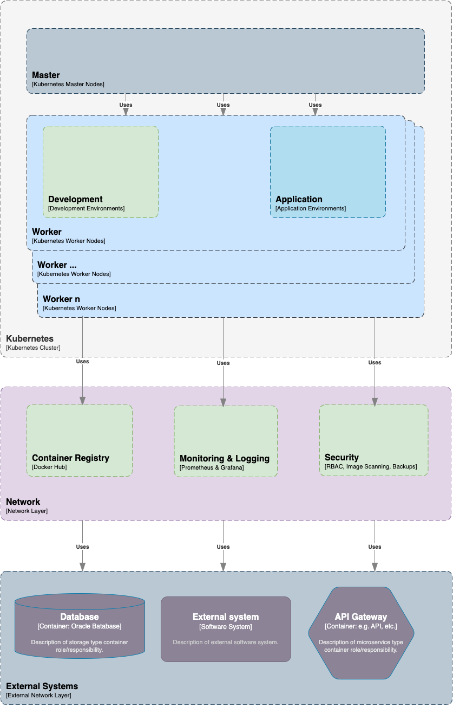

# 5. Bausteinsicht

## 5.1 Bausteindiagramm

## 5.2 Bausteinbeschreibung

### **Kubernetes Cluster**

- **Master Node**: Verwaltung und Steuerung des Clusters.
- **Worker Nodes**: Ausführung der Container.

  
### **Entwicklerumgebung**

- **CI/CD Tools**: Jenkins für die kontinuierliche Integration und Bereitstellung.
- **Version Control**: Git für die Versionsverwaltung.

### **Container Registry**

- **Docker Hub**: Verwaltung und Speicherung von Container Images.

### **Monitoring und Logging**

- **Prometheus**: Überwachung und Alarmierung.
- **Grafana**: Visualisierung der Metriken.
- **Elasticsearch, Fluentd, Kibana (EFK Stack)**: Zentrale Speicherung und Analyse von Logs.

### **Security**

- **RBAC**: Verwaltung von Benutzerrechten.
- **Image Scanning**: Sicherheitsüberprüfung von Container Images (z.B. Clair).

### **Integration von Umsystemen**

- **API Gateway**: Verwaltung der Schnittstellen zu externen Systemen.
- **Service Mesh**: Verwaltung der Kommunikation zwischen Microservices (z.B. Istio).
- **Datenbank Mesh**: Relationales Datenbank (z.B. Oracle).
