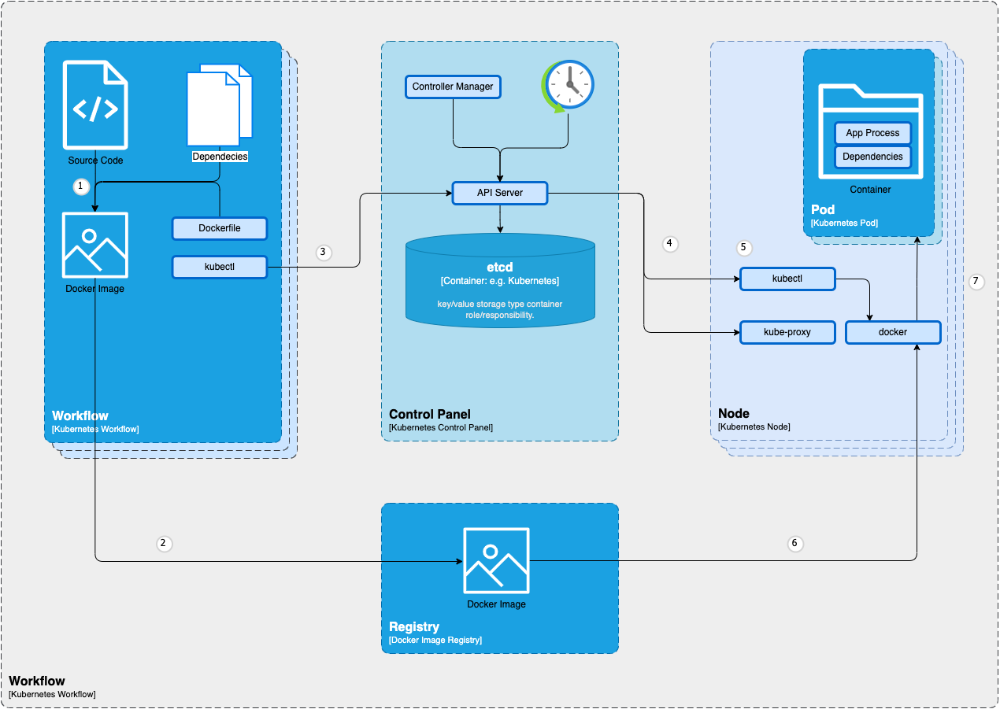

# 6. Laufzeitsicht

## 6.1 Hauptszenarien
- **Deployment von Anwendungen**: Ablauf von der Code-Übernahme aus dem Repository, über die CI/CD Pipeline, bis zur Bereitstellung im Kubernetes Cluster.
- **Monitoring und Logging**: Erfassung und Analyse von Metriken und Logs zur Überwachung des Systemzustands.
- **Sicherheitsüberprüfung**: Scannen und Überprüfen von Container Images vor der Bereitstellung.
